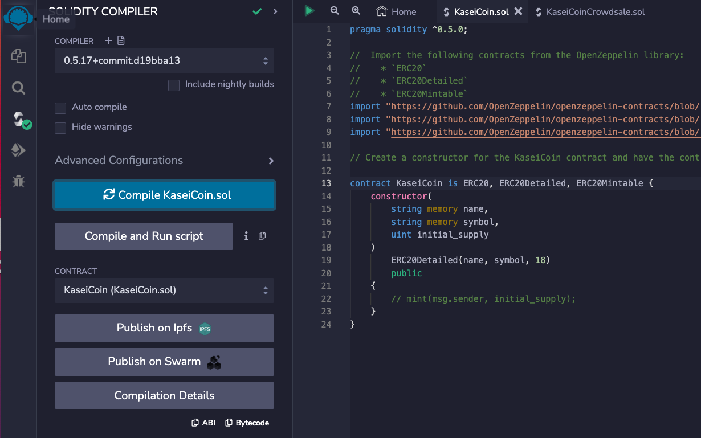
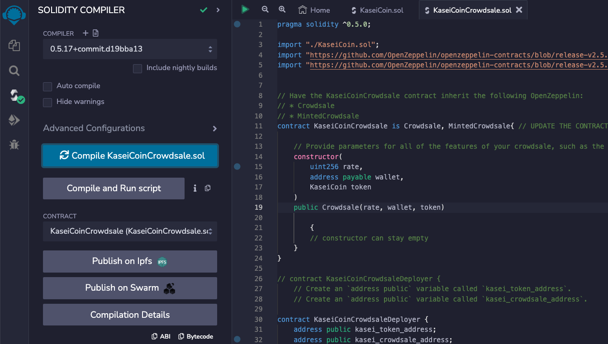
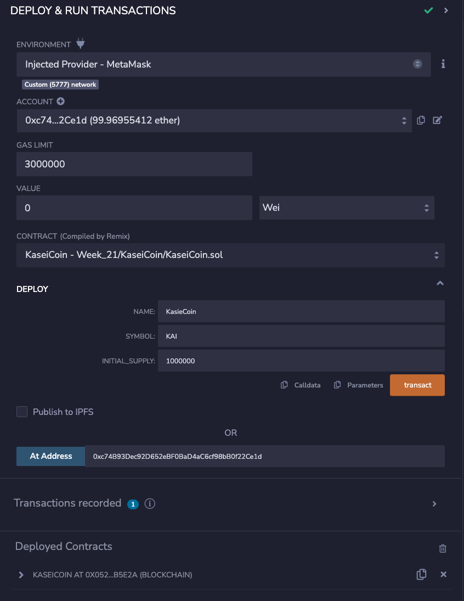
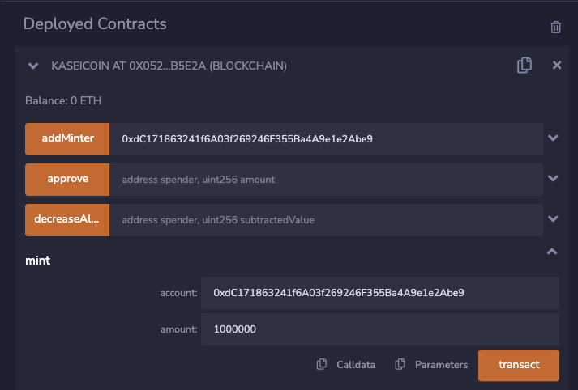
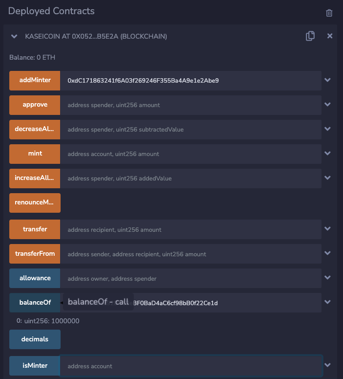
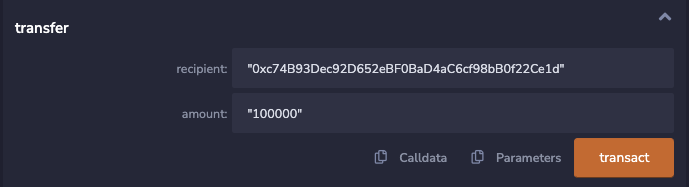
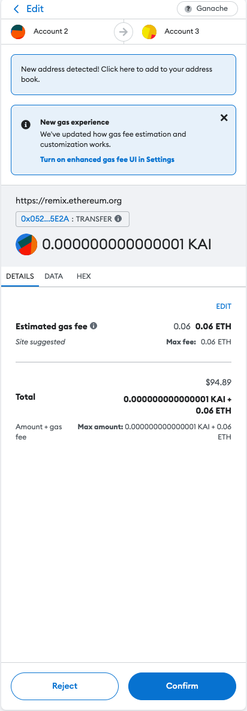
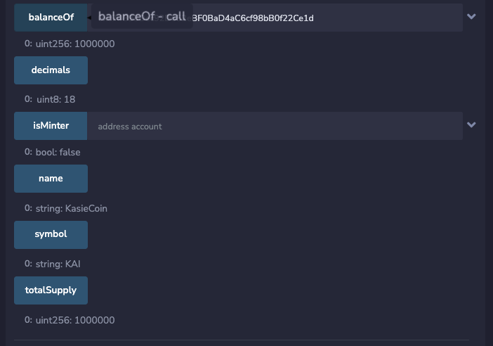

# Module_21__Martian_Token_Crowdsale
## KaseiCoin, A new monetary system for Mars.
### Background

The Martian Aerospace Agency selected me to lead a project developing a monetary system for the new Mars colony. The new monetary system is based on blockchain technology as a cryptocurrency named KaseiCoin. (Kasei means Mars in Japanese.)
KaseiCoin will be a fungible token that’s ERC-20 compliant. A crowdsale of KaseiCoin (KAI) will allow people who are moving to Mars to convert their earthling money to KaseiCoin.

##  The KaseiCoin Token Contract

The KaseiCoin Token contract was complied using Solidity compiler version ^0.5.0

##  The KaseiCoin Crowdsale Contract

The KaseiCoin Crowdsale and Deployer Contracts were then complied.

##  Deployment and testing

I then deployed and tested the Crowdsale on the local block chain using Remix, MetaMask and Ganache.

The following screenshots are showing successful testing results. Account balances after execution of sales. Review of supply of minted tokens and wei raised as a part of the sales shown below;

 ###  Minting

### Balance check

### Transfer function

### MetaMask connectivity & interaction

### Other functionality checking

